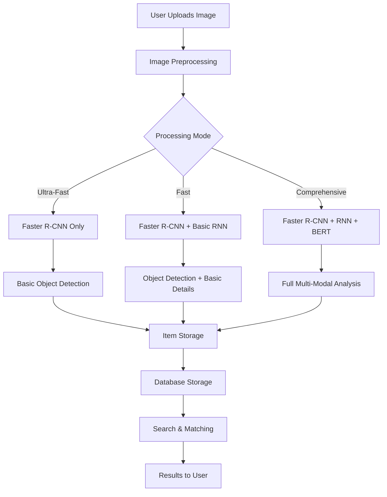
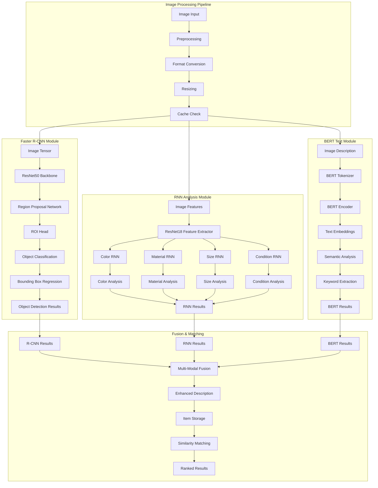
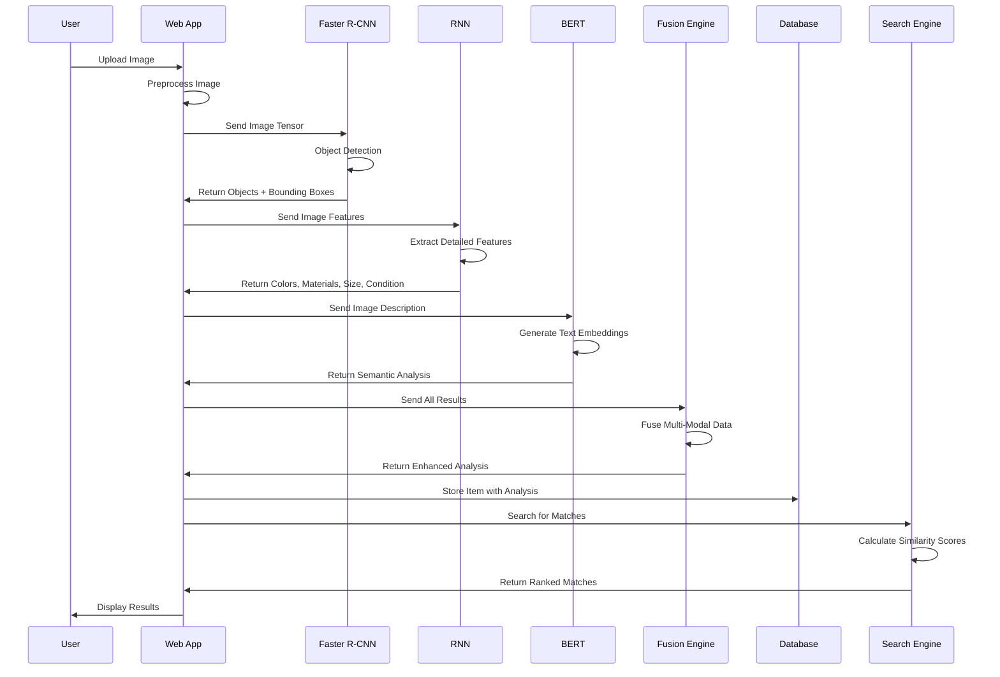
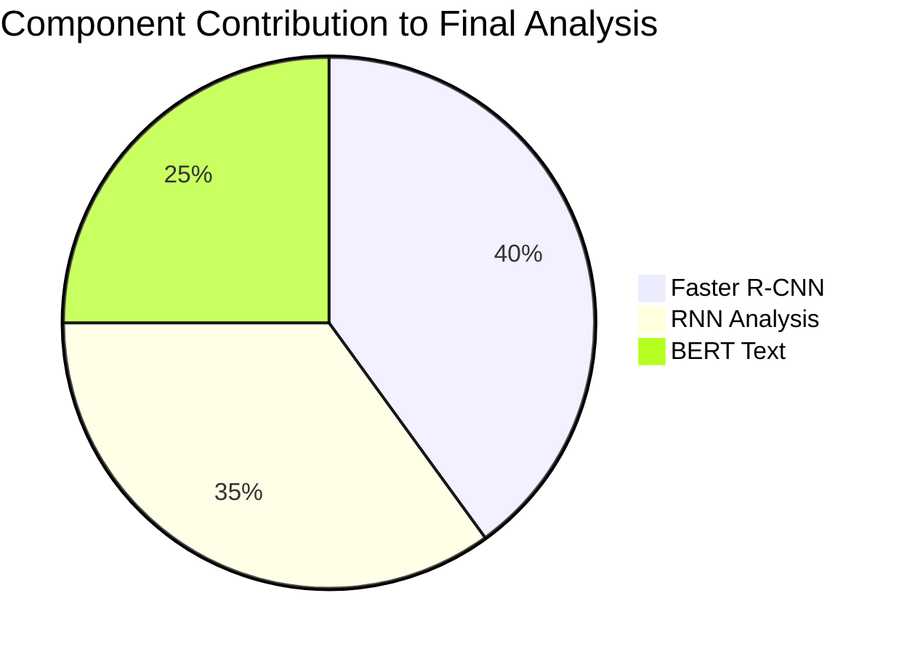
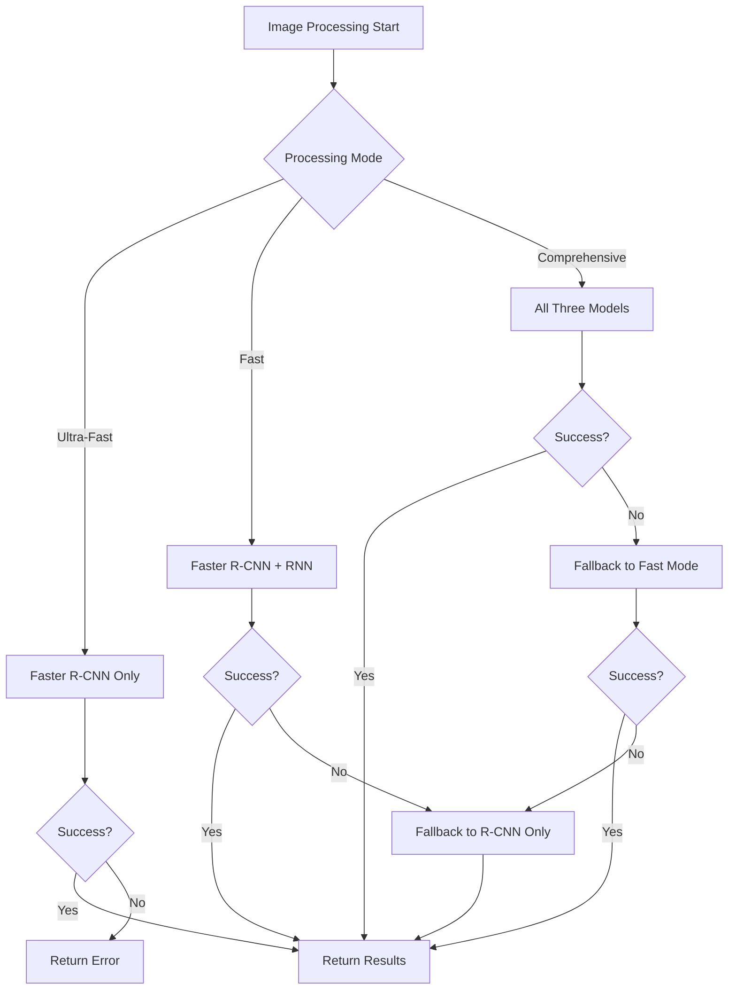
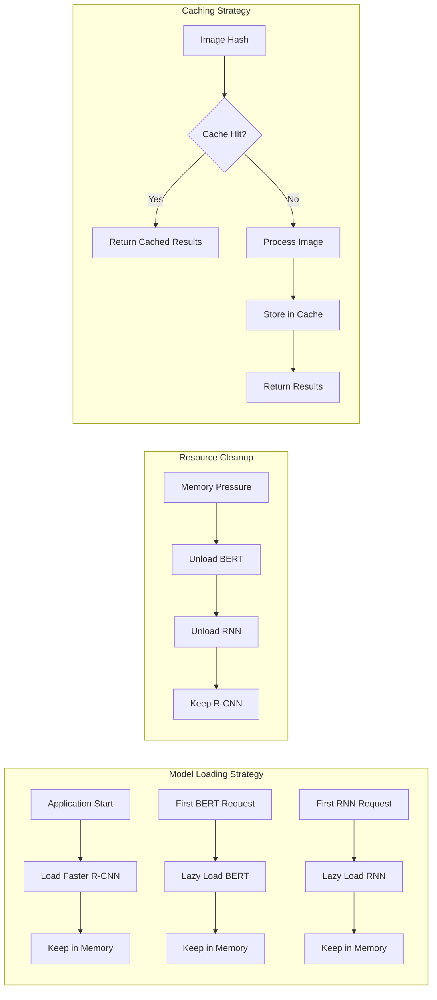

# Lost and Found System - Visual Architecture Diagram

## High-Level System Flow

## Detailed Component Interaction

## Data Flow Sequence

## Component Weight Distribution

## Processing Time Breakdown

```mermaid
gantt
    title Processing Time Distribution (Comprehensive Mode)
    dateFormat X
    axisFormat %L ms
    
    section Faster R-CNN
    Image Preprocessing    :0, 200
    Object Detection      :200, 1200
    Post-processing       :1200, 1500
    
    section RNN Analysis
    Feature Extraction    :1500, 2000
    Color Analysis        :2000, 2500
    Material Analysis     :2500, 3000
    Size Analysis         :3000, 3500
    Condition Analysis    :3500, 4000
    
    section BERT Text
    Description Generation :4000, 4200
    Tokenization         :4200, 4400
    Encoding             :4400, 5000
    Semantic Analysis    :5000, 5200
    
    section Fusion
    Multi-modal Fusion   :5200, 5500
    Description Generation :5500, 5700
    Final Scoring        :5700, 6000
```

## Error Handling and Fallbacks

## Memory and Resource Management

## Performance Metrics

| Component | Processing Time | Memory Usage | Accuracy | Reliability |
|-----------|----------------|--------------|----------|-------------|
| Faster R-CNN | 1-2 seconds | 2-3 GB | 85-90% | High |
| RNN Analysis | 2-3 seconds | 1-2 GB | 75-85% | Medium |
| BERT Text | 1-2 seconds | 1-2 GB | 80-90% | High |
| Fusion Engine | 0.5 seconds | 0.5 GB | 90-95% | High |

## Integration Points

1. **Image Processing Pipeline**: Seamless handoff between preprocessing and model inference
2. **Multi-Modal Fusion**: Intelligent combination of all three model outputs
3. **Caching Layer**: Transparent caching for performance optimization
4. **Error Handling**: Graceful degradation and fallback mechanisms
5. **Database Integration**: Efficient storage and retrieval of analysis results
6. **Search Engine**: Real-time similarity matching using all model outputs
