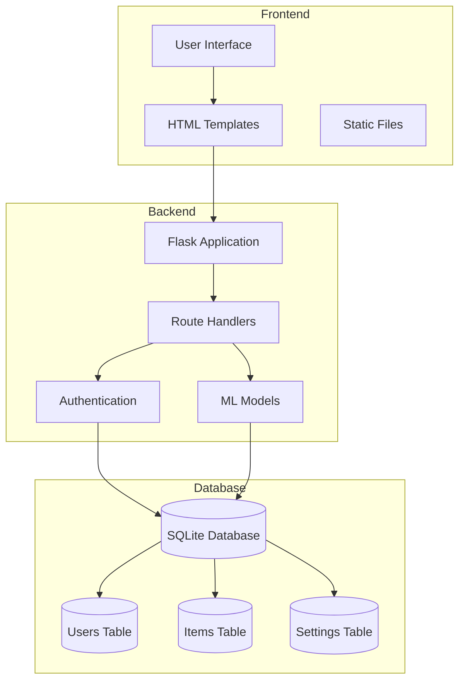
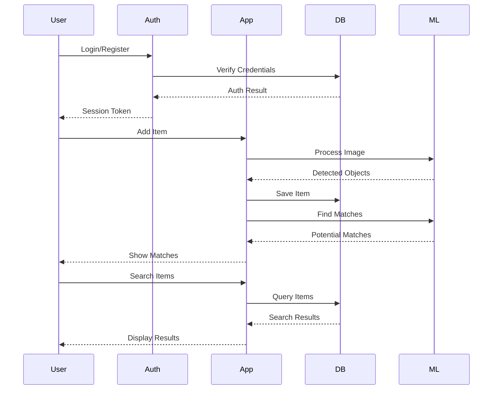
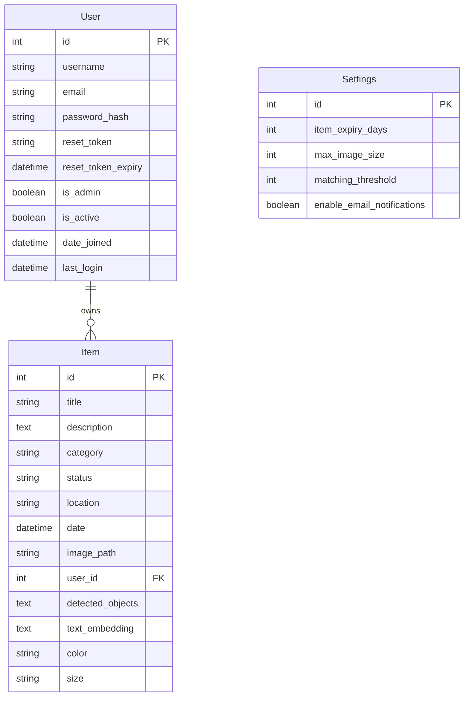
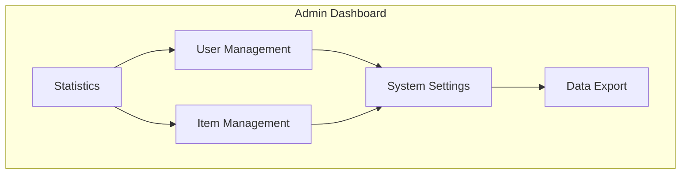
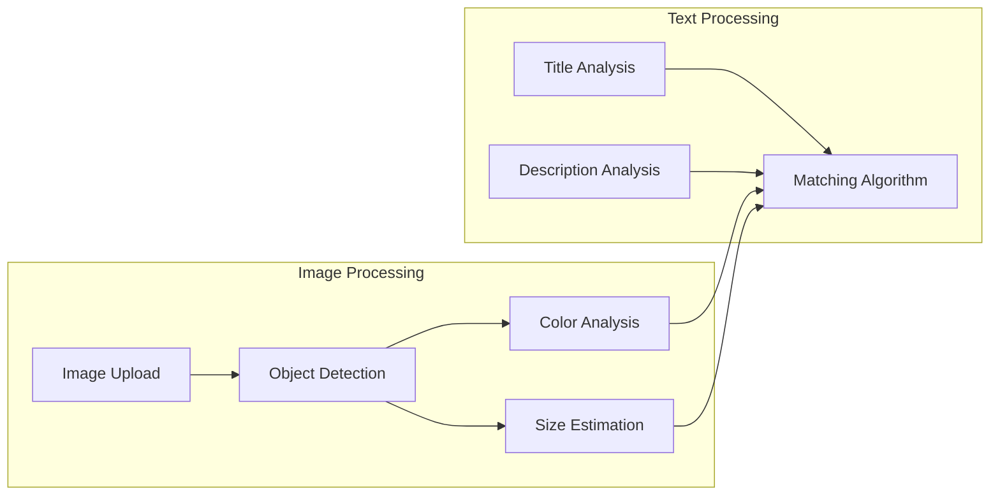
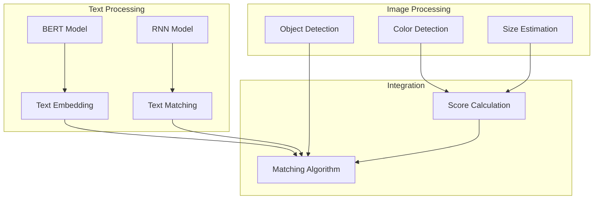
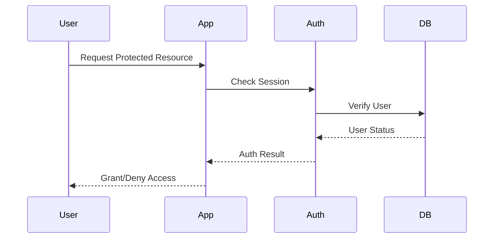
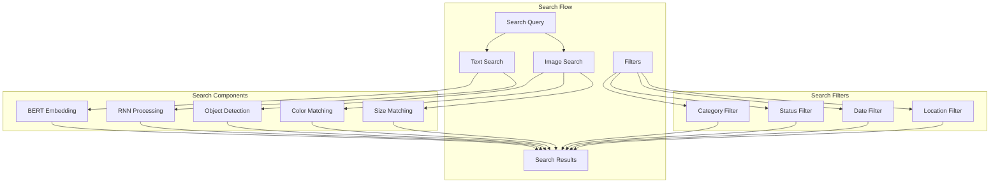

# Lost & Found Application Architecture

## System Overview



## User Flow



## Database Schema



## Admin Dashboard Structure



## ML Processing Pipeline



## ML Models Architecture



## ML Model References

### BERT (Bidirectional Encoder Representations from Transformers)
- **Purpose**: Text understanding and semantic matching
- **Implementation**: Using pre-trained BERT model for:
  - Text embedding generation
  - Semantic similarity calculation
  - Item description understanding
- **Key Features**:
  - Bidirectional context understanding
  - Pre-trained on large text corpus
  - Fine-tuned for item matching

### RNN (Recurrent Neural Network)
- **Purpose**: Sequence processing and pattern recognition
- **Implementation**: Using RNN for:
  - Text sequence analysis
  - Pattern matching in item descriptions
  - Temporal feature extraction
- **Key Features**:
  - Sequential data processing
  - Long-term dependency learning
  - Pattern recognition in text

### Integration Points
1. **Text Processing Pipeline**:
   - BERT for initial text embedding
   - RNN for sequence analysis
   - Combined features for matching

2. **Matching Algorithm**:
   - BERT embeddings for semantic similarity
   - RNN patterns for sequence matching
   - Combined scoring system

3. **Performance Optimization**:
   - Batch processing for BERT
   - Sequence batching for RNN
   - Caching of embeddings

### Model Usage Examples
```python
# BERT Usage
text_embedding = text_analyzer.analyze_text(f"{title} {description}")

# RNN Usage
sequence_features = sequence_processor.process(description)

# Combined Matching
similarity = text_analyzer.compute_similarity(query, item_text)
```

## Security Flow



## Search Implementation



## Search Implementation Details

### Search Components
1. **Text Search**
   - BERT for semantic understanding
   - RNN for pattern matching
   - Keyword matching
   - Category matching

2. **Image Search**
   - Object detection
   - Color analysis
   - Size estimation
   - Visual similarity

3. **Filters**
   - Category filtering
   - Status filtering (lost/found)
   - Date range filtering
   - Location-based filtering

### Search API Endpoints
```python
# Search endpoint
@app.route('/search')
def search():
    query = request.args.get('q', '')
    category = request.args.get('category', '')
    status = request.args.get('status', '')
    
    # Implementation details...
```

### Search Features
1. **Text-based Search**
   - Semantic search using BERT
   - Pattern matching using RNN
   - Category-based filtering
   - Status-based filtering

2. **Image-based Search**
   - Object detection
   - Color matching
   - Size comparison
   - Visual similarity

3. **Combined Search**
   - Text + Image search
   - Multiple filter combinations
   - Relevance scoring
   - Result ranking

### Search Results
- Sorted by relevance
- Filtered by category
- Filtered by status
- Filtered by date
- Filtered by location 